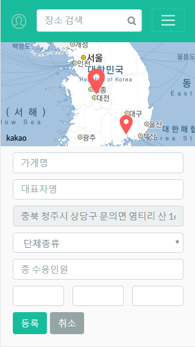
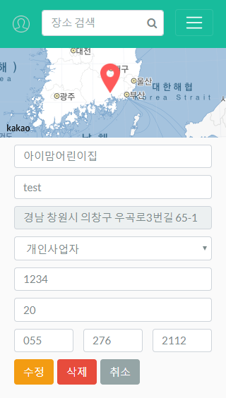

# SpringBoot Project
spring boot + jwt + jpa + thymeleaf

- 해당 업장에 몇 명의 사람이있고 성비가 어떻게 되는지 알 수 있게 해주는 기능을 만들고자 함.

- spring security role을 이용하여 USER/CUSTOMER/ADMIN
총 3개의 권한 사용
- ajax를 통한 validation check

- 일반 USER 회원가입 페이지
- ajax를 통한 validation check

- 법인 CUSTOMER 회원가입 페이지
- 법인회사 판별 Api도입 예정
- ajax를 통한 validation check

- CUSTOMER로그인시 나오는 메인페이지로 등록된 업장의 리스트를 보여준다
- 해당페이지에서 현재 인원과 성비율을 입력 할 수있다.
- 추가 적으로 더 업장을 등록하고자 할 때

- 등록 버튼을 누르면 해당 map 페이지로 간다
- 카카오 맵 api를 도입했으며 좌표기능을 대부분 구현했다.

